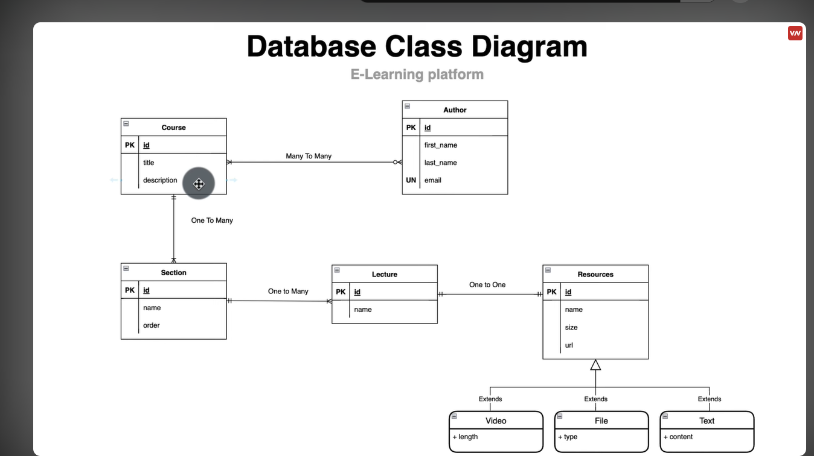
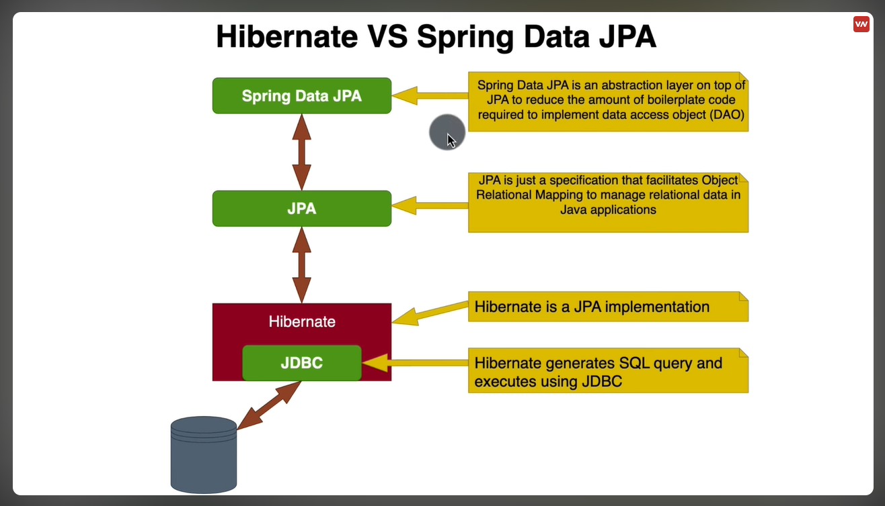
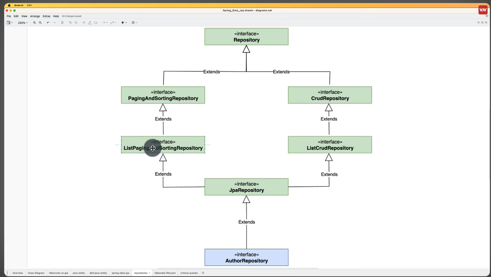
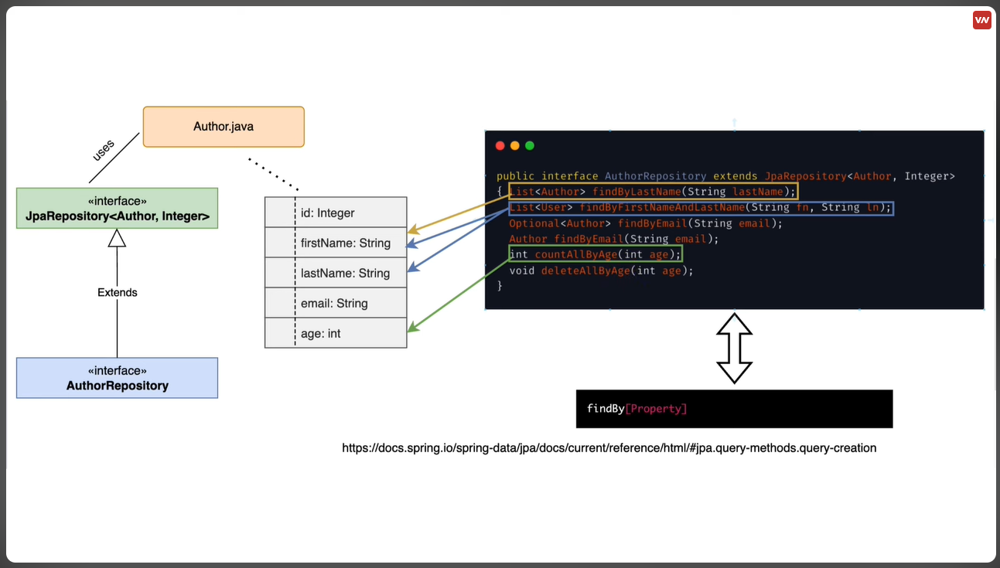
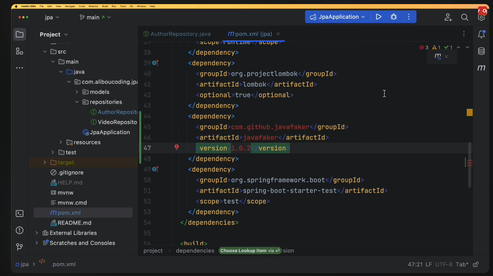
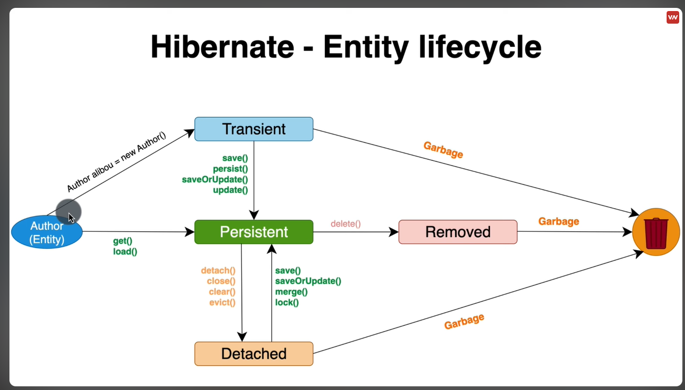

# Perfect-data-jpa
Spring boot data JPA

## Course MUST have an author but not necessarily for an author to a course.
### HikariCP is a high-performance JDBC connection pool for Java.
Many to many relationship but with a mandatory Course to Author but not vice-versa.

The first image is an ERD (Entity-Relationship Diagram) for the overall project.

*ERD (Entity-Relationship Diagram) for the overall project.*

*Illustrates the integration of JPA (Java Persistence API), Spring Data, and Hibernate.*

*How Spring boot data jpa integrates into the transactional JPAs.*

*Common JPA abstracted methods.*

*Creating easier data faker.*

*Entity life Cycle for JPA dml transactions.*

#### UNI AND BI DIRECTIONAL RELATIONSHIP

#### 1. DATA ACCESS NEEDS- If you frequently need to navigate the relationship from both sides, use bidirectional. If access is primarily one-sided, use unidirectional
#### 2. Bidirectional relationship might be complex to maintain, potential performance overhead- additional joins. Uni directional where bi is unnecessary.

#### In ManyToMany relationship, we have 
##### a.) the owner of the relationship(who is responsible for maintaining the fk in the join table)
##### b.) the inverse of the relationship( does not have fk in the join table)

##### i.e Course is owner and Author is the inverse relationship.

#### SPRING DATA JPA INHERITANCE STRATEGIES

##### *1. Single Table Strategy.*
-> All sub classes are mapped to the same table. Then discriminatory column is used to distinguish between different subclasses.
-> All the properties of parent entity class and its sub classes will be persisted into a single table.
-> Best suited for small classes because makes the code loong.
##### *2. Join Table Strategy.*- this is complex
-> Each sub class will have its onw table.
-> During insertion it will also insert twice, the sub class and parent.
##### *3. Table per class Strategy.*
-> Each concrete sub class is mapped to a separate class.
-> i.e that is we will have a table video with all the resources elements. Own table with a copy of everything from the parent class.
-> Can lead to efficient queries but many tables on the schema making it complex.
-> Preferred when you have fewer classes.

#### COMPOSITION OVER INHERITANCE TO AVOID RIGIDITY.